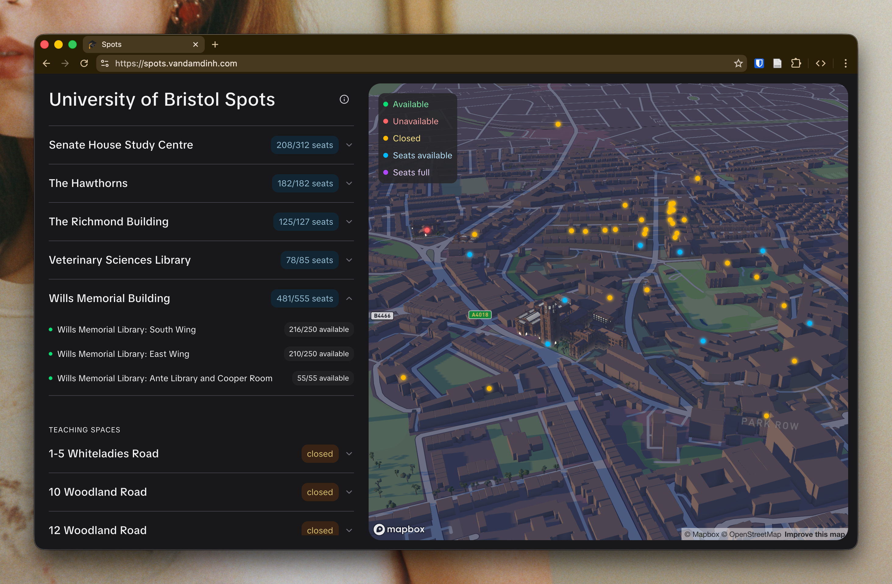

# Spots

**Spots** is a web application designed to help students at the University of Bristol find open classrooms for studying. I've updated this to also show library capacities.

Largely inspired by Akshar Barot's [spots](https://github.com/notAkki/spots)! Thanks :)